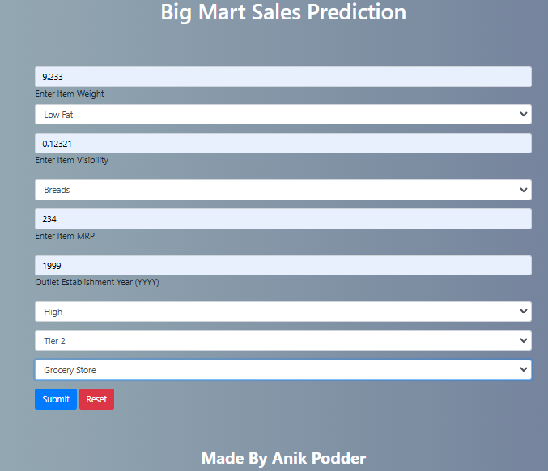

# Big Mart Sales Prediction

## Overview
The **Big Mart Sales Prediction** project aims to predict the sales of various products in a big mart based on historical sales data. By analyzing various factors like product features, promotions, and store location, this model predicts the sales for a given product. The project utilizes Machine Learning techniques, including Random Forest Regression and Grid Search for hyperparameter tuning.

This system is designed to help Big Mart management make data-driven decisions by providing sales predictions based on past data, improving inventory management and sales strategy.

## Table of Contents
- [Project Description](#project-description)
- [Technologies Used](#technologies-used)
- [Features](#features)
- [Screenshots](#screenshots)
- [Installation Guide](#installation-guide)
- [Usage](#usage)

## Project Description
This project includes:

- **Data Preprocessing**: Cleaning and preparing the raw data, handling missing values, and feature engineering.
- **Model Building**: Using Random Forest Regression for predicting sales, along with Grid Search for tuning the hyperparameters.
- **Interface**: A simple web interface for inputting product and store details and predicting sales based on user inputs.

The goal is to provide a simple and effective way for store managers to predict the sales and plan inventory effectively.

## Technologies Used
- **Python**: For data preprocessing, building the prediction model, and backend development.
- **Flask**: To create a simple web interface for users to interact with the model.
- **Machine Learning Libraries**:
  - **Pandas**, **Numpy**: Data manipulation and preprocessing.
  - **Scikit-learn**: Machine Learning algorithms and tools.
  - **Matplotlib**, **Seaborn**: Visualization tools.
- **Git & GitHub**: Version control and collaboration.
- **HTML**, **CSS**, **JavaScript**: For front-end interface development.

## Features
- **Sales Prediction**: Predict the sales of a product in a specific store based on historical data.
- **User-Friendly Interface**: Simple web interface to input the data and get predictions.
- **Accuracy**: Improved prediction accuracy with Random Forest and Grid Search tuning.
- **Interactive**: Easy interaction with the model for testing different input conditions.

## Screenshots

### Home Page


### Prediction Page


## Installation Guide

### Prerequisites
- **Python 3.x**
- **pip** (Python package installer)

### Step-by-Step Installation

1. Clone the repository:
   ```bash
   git clone https://github.com/anikpodder/big-mart-sales-prediction.git

2. Navigate to the project directory:
   ```bash
   cd big-mart-sales-prediction

3. Install the required dependencies:
   ```bash
   pip install -r requirements.txt

4. Run the Flask app:
   ```bash
   python app.py

5. Open your browser and go to http://127.0.0.1:9457 to interact with the app.

### Usage
Input the product and store details, including features like product weight, store area, and product type.
Click on the submit button to get the sales prediction for the given product and store.
The predicted sales value will be displayed on the interface.
